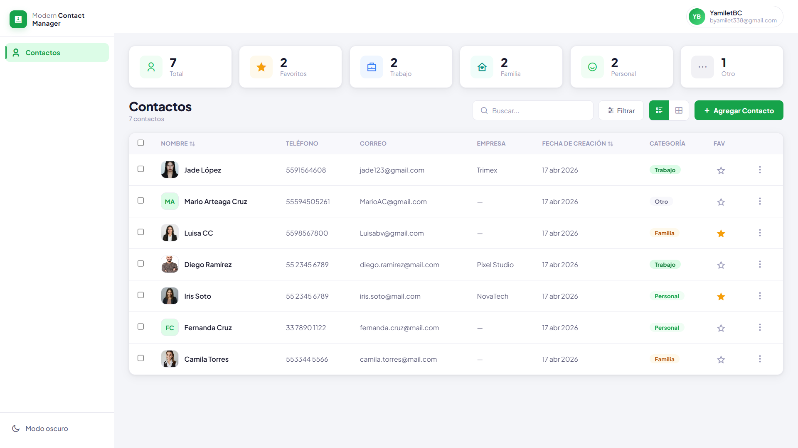
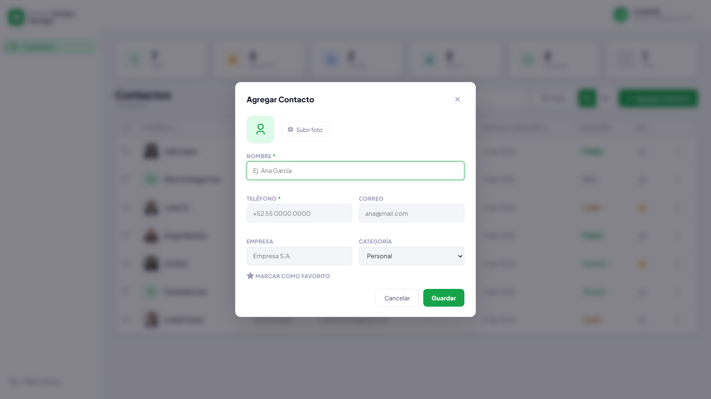
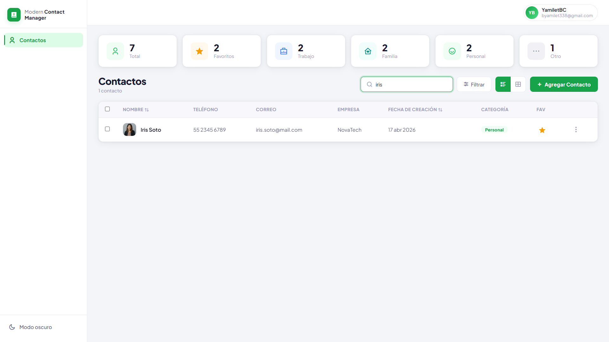
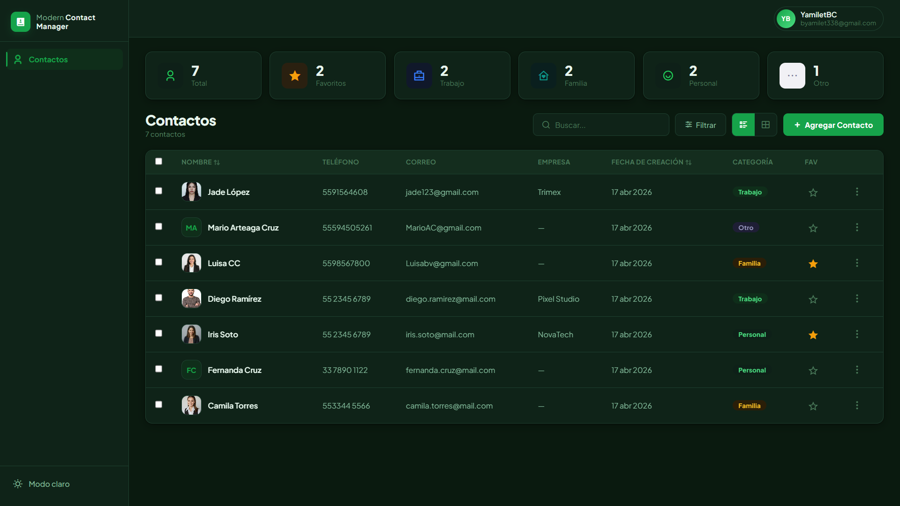
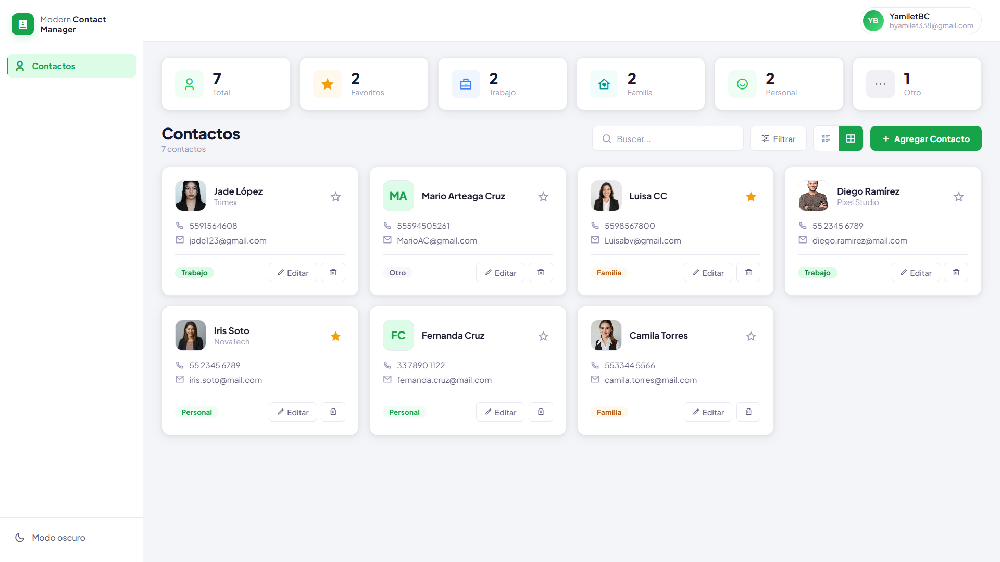
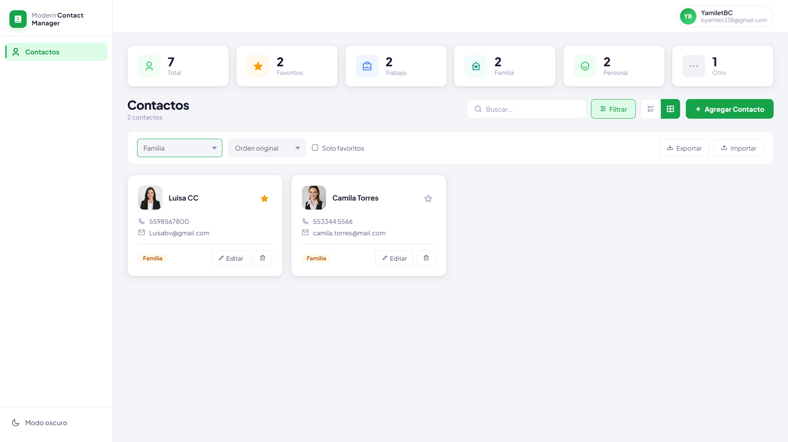

<div align="center">

# Modern Contact Manager

Aplicación web moderna, responsive y escalable para administrar contactos con interfaz tipo dashboard, búsqueda en tiempo real y modo oscuro.

[]()
[]()
[]()
[]()
[]()
[]()

### Demo en línea

**(Agrega aquí tu link de GitHub Pages o Vercel)**

</div>

---

## Descripción

Modern Contact Manager es una aplicación desarrollada con HTML, CSS y JavaScript puro. Permite gestionar contactos de forma rápida, visual y organizada mediante una interfaz moderna tipo CRM/dashboard. Está enfocada en brindar una excelente experiencia de usuario en escritorio, tablet y móvil.

---

## Características principales

| Funcionalidad      | Descripción                           |
| ------------------ | ------------------------------------- |
| Agregar contactos  | Registro de nuevos contactos          |
| Editar contactos   | Actualización de información          |
| Eliminar contactos | Eliminación con confirmación          |
| Búsqueda en vivo   | Filtrado instantáneo                  |
| Favoritos          | Marcado de contactos importantes      |
| Categorías         | Organización por tipo                 |
| Vista tabla        | Formato profesional de listado        |
| Vista tarjetas     | Visualización moderna                 |
| Estadísticas       | Resumen dinámico de contactos         |
| Tema visual        | Modo claro y oscuro                   |
| Responsive         | Adaptado a móvil, tablet y escritorio |
| UI Moderna         | Diseño limpio y profesional           |

---

## Módulos del sistema

| Módulo               | Estado     |
| -------------------- | ---------- |
| Dashboard principal  | Disponible |
| Gestión de contactos | Disponible |
| Favoritos            | Disponible |
| Búsqueda dinámica    | Disponible |
| Categorías           | Disponible |
| Tema oscuro          | Disponible |
| Vista tarjetas       | Disponible |
| Responsive Design    | Disponible |

</div>

---

## Tecnologías utilizadas

<div align="center">

[]()
[]()
[]()
[]()

</div>

---

## Estructura del proyecto

```text
modern-contact-manager/
│── README.md
│── index.html
│── style.css
│── script.js
│── add-contact-modal.png
│── card-view.png
│── dark-mode.png
│── dashboard-main.png
│── filter-contacts.png
└── search-contact.png
```

---

## Vista previa

## Dashboard principal


---

## Agregar contacto


---

## Buscar contacto


---

## Modo oscuro


---

## Vista tarjetas


---

## Filtrado de contactos


## Competencias demostradas

---

* Desarrollo frontend con JavaScript puro.
* Manipulación dinámica del DOM.
* Diseño de interfaces modernas.
* Responsive Design.
* Gestión de eventos.
* Persistencia con LocalStorage.
* Organización profesional del código.
* Experiencia de usuario enfocada en productividad.

---

## Enfoque profesional

Proyecto orientado a demostrar habilidades técnicas en desarrollo web mediante una solución funcional, visualmente cuidada y enfocada en mantenibilidad, escalabilidad y experiencia de usuario.

---

## Autor

**Yamilet Bustamante Cagal**
